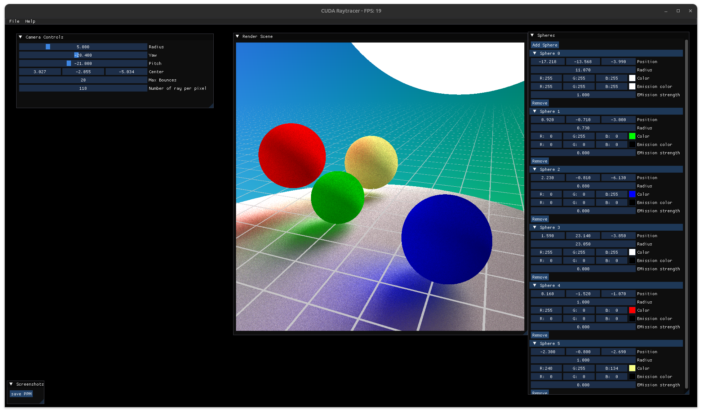

# CUDA Raytracer

This project is a simple GPU-based raytracer using CUDA, C++, SDL2, ImGui and
OpenGL. It supports rendering single images, generating frame sequences from
user inputs in realtime and creating animated GIFs.



## Requirements

- **CUDA Toolkit** (for `nvcc`)
- **C++17 compiler** (`g++` recommended, this is the default used by `Make`)
- **SDL2 development libraries**
- **ImageMagik**
- **[Assimp](https://github.com/assimp/assimp?tab=readme-ov-file)**
- **Make**

## Build instructions

Clone the repository and build the project using `make`:

```sh
git clone --recurse-submodules git@github.com:tombrossard0/raytracing-with-cuda.git
cd raytracing-with-cuda
make
```

This will compile all sources and place the executable in `build/raytracer`.

## Running

### Render an image

```sh
make run-image
```

This command will generate the `build/output.ppm` file and converts it to
`build/output.png` with **ImageMakik**.

### Render a GIF

```sh
make run-video
```

This command will generate all `build/frame_XXX.ppm` files and converts them to
`build/camera_rotation.gif` with **ImageMakik**.


### Run the interactive Application

```sh
make run
```

Opens a window with **SDL2** and **ImGui** controls, e.g, to adjust camera,
raytracing settings and add/remove objects from the scene.

### Cleaning Build Artifacts

```sh
make clean
```

Removes `build/` folder, PPM/PNG outputs, and generated frames.

### Controls

- Adjust **Max Bounces** and **Number of Rays per Pixel** via ImGui sliders.

## Notes

- Ensure your GPU supports **CUDA**.
- Large numbers of rays per pixel or bounces may significantly increase render time.

## Thanks

The project was motivated thanks to the video of [Sebastian Lague](https://www.youtube.com/watch?v=Qz0KTGYJtUk&t=1s&ab_channel=SebastianLague) about **Ray Tracing**. The Knight's model comes from
his video.